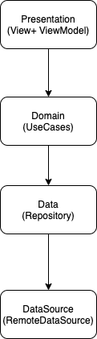
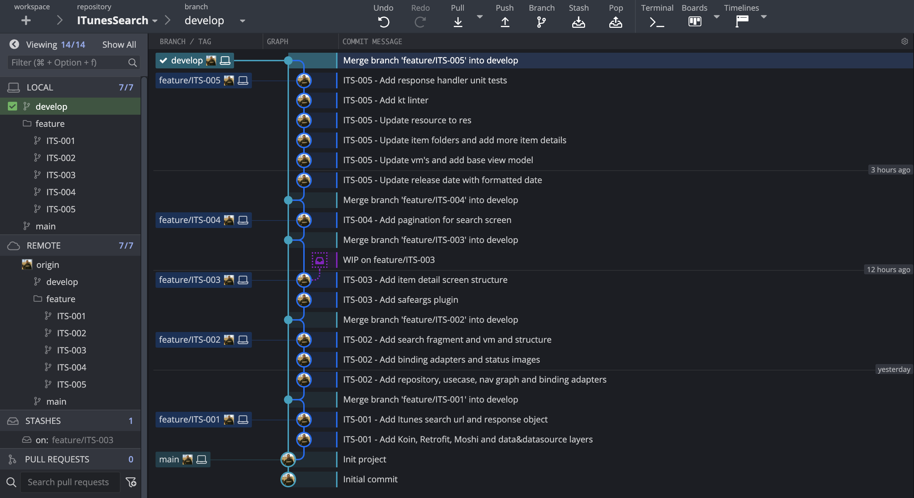

# ITunesSearch

## Requirements
- Kotlin 1.3x
- Android API 26+
- JDK at least 1.8

## Installation

#### Dependencies
For Gradle dependencies, `Android Studio` will take care of them. So, simply open project in Android Studio then wait
for Gradle Sync. You are ready to go! Used libraries in the project is :  

- Retrofit2  
- Moshi  
- Glide  
- Jetpack Architecture Components (Coroutines, LiveData, Jetpack Navigation)  
- SafeArgs Plugin : is a Gradle Plugin that generates code to help guarantee that the arguments on both side matches up while also simplifying argument passing between fragments.
- Koin for dependency Injection

## Structure  
The used architectural pattern in the project is MVVM with Clean Architecture. Project consist of 4 layers   
- Presentation : Includes activities, fragments, view-models and UI related things.   
- Domain : Includes usecases, domain object models, repository interfaces.   
- Data : Includes repository implementations, data-level model objects, data-source interfaces.  
- DataSource : Includes data-source implementations, API interfaces, response handlers and data-source models.   
   

Commit Message Convention 

 - Add: A new feature or file  
 - Update: Update a file or structure
 - Fix: Fix changes  
 - Remove: Remove a file or code  

Commit messages and branches are below:

Project divided into 5 tasks, ITS(ITunes Search):   
ITS-001 - Add base structure for the project  
ITS-002 - Create Search & List screen    
ITS-003 - Create Search Item Detail Screen   
ITS-004 - Add pagination for search screen   
ITS-005 - Refactor code and add tests.  

